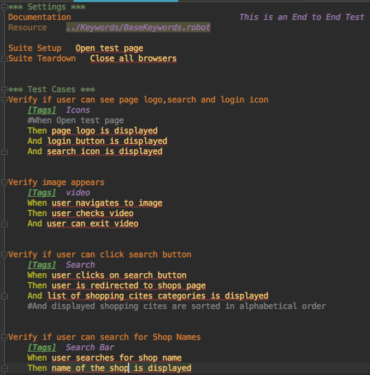
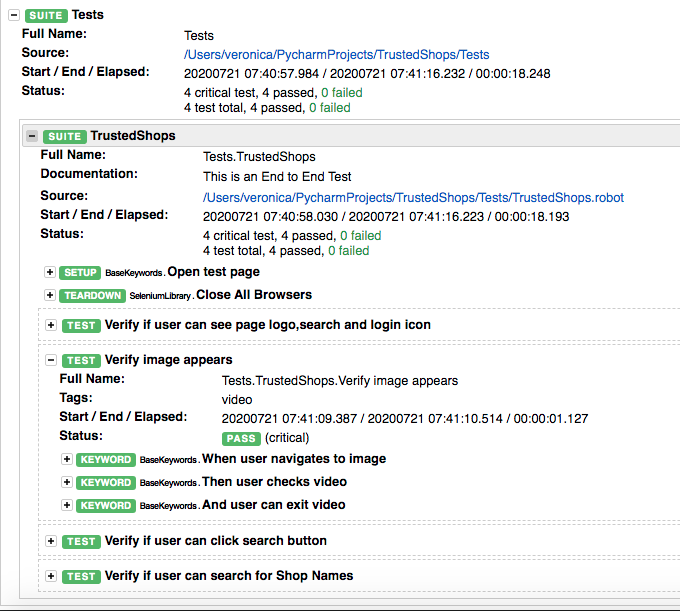

# Robot Framework

An open source test automation framework for acceptance testing and acceptance test-driven development. It is a python based automation framework that follows a keyword-driven, behaviour-driven and data-driven approach for writing test cases. This feature makes it very easy to understand. Test cases are written using keyword style in a tabular format. 

# Getting Started

When Robot Framework is started, it processes the data, executes test cases and generates logs and reports

## Prerequisites

* Install Python 2.7.14 or above
* Install the python package manager (pip)
* Download a development environment e.g pyCharm

### Installing

Using PIP
Once you have pip installed, you can use pip on the command line which is very easy. The easiest way to use pip is by letting it find and download packages it installs from the Python Package Index (PyPI), but it can also install packages downloaded from the PyPI separately. The most common usages are shown below and pip documentation has more information and examples.

#### Install the latest version (does not upgrade)
pip install robotframework

#### Upgrade to the latest version
pip install --upgrade robotframework

#### Install a specific version
pip install robotframework==2.9.2

#### Install separately downloaded package (no network connection needed)
pip install robotframework-3.0.tar.gz

#### Install latest (possibly unreleased) code directly from GitHub
pip install https://github.com/robotframework/robotframework/archive/master.zip

#### Uninstall
pip uninstall robotframework

### Running the Tests

 Test cases are executed from the command line, and the end result is, by default, an output file in XML format and an HTML report and log
 
 To run this test case, we can use: *robot -d Results Tests*

### End to End Test

  * Robot Framework allows different styles of creating more readable scripts. 
  * For this test case we use Gherkin syntax to create a more readable script. Gherkin uses a set of special keywords to give structure and meaning to executable specifications. 
   

The Given and Ands in our test case are the preconditions that setup the test case, When is the actual test itself and Then is the expected results. 
We can place our cursor in any keyword and click on *CTRL + B* and it will take us to the Resource file that holds that keyword where we call methods on page objects.

  * example: When a user checks video, we are going to wait until page contains the video then user can click on play to play video.
  
  
This is also demonstrated in the Test Results where we see the style the test case. Expanding any of the keywords gives more details and we can see that the files are using Selenium Library keywords. 
  
  

